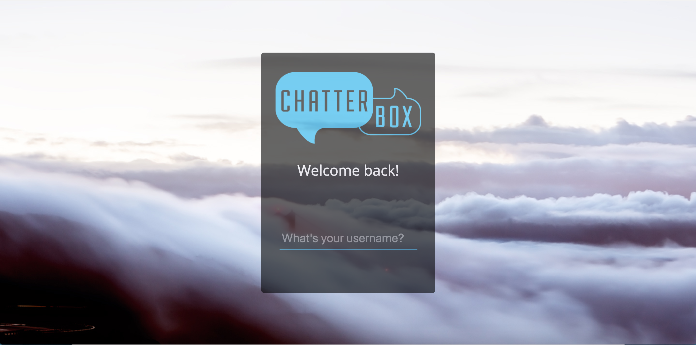
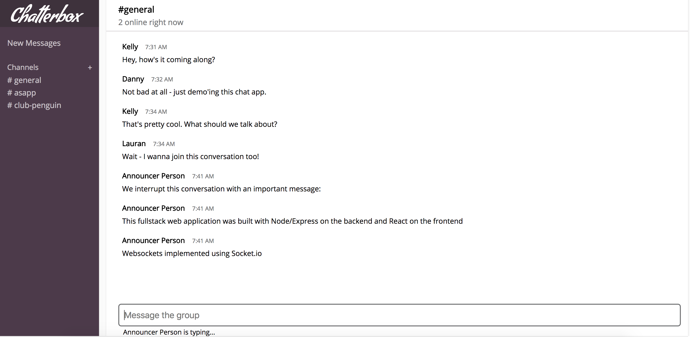
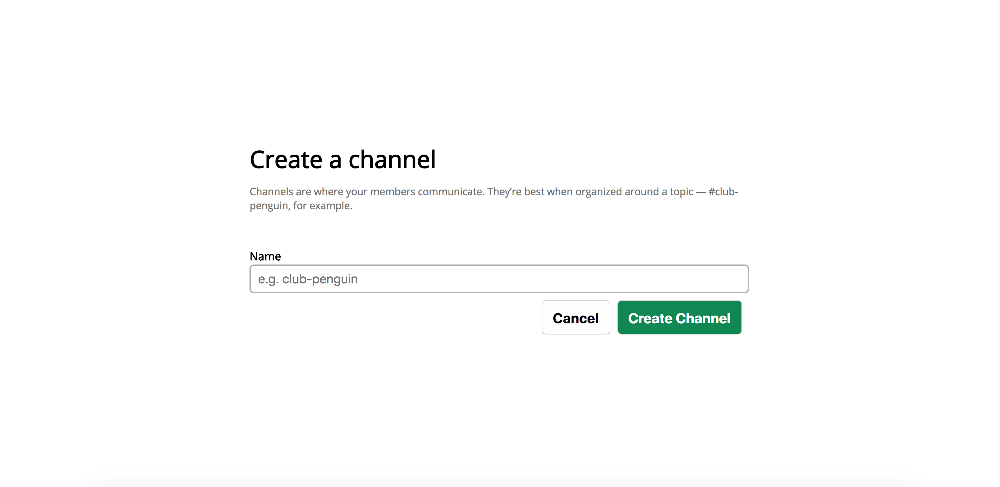
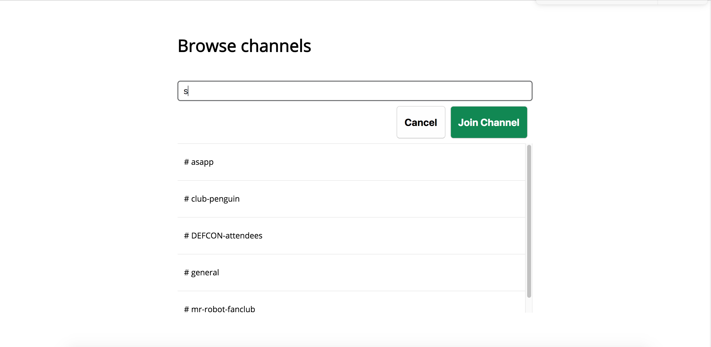

# Chatterbox

**Chatterbox** is a single page fullstack web application built with
JavaScript:

1. [Node.js](https://nodejs.org/en/)/[Express](https://expressjs.com/)
on the backend
2. [React](https://reactjs.org/) on the frontend.
3. Websockets were implemented using [socket.io](https://socket.io/)
4. Data persisted with a [MySQL](https://www.mysql.com/) database
5. Containerization with [Docker](https://www.docker.com/)

### Features

##### Login with any unique username

##### Chat with any online users in any of the public channels

##### Create new channels for other users to join

##### Search the database for an existing channel by its title

### Setup Instructions

To get the project up and running:

1. Pull the repository down or download the zip file
2. Install Docker https://docs.docker.com/engine/installation/
3. Once done, run `docker-compose up fullstack` in your terminal
2. Test that it's running http://localhost:13000/
